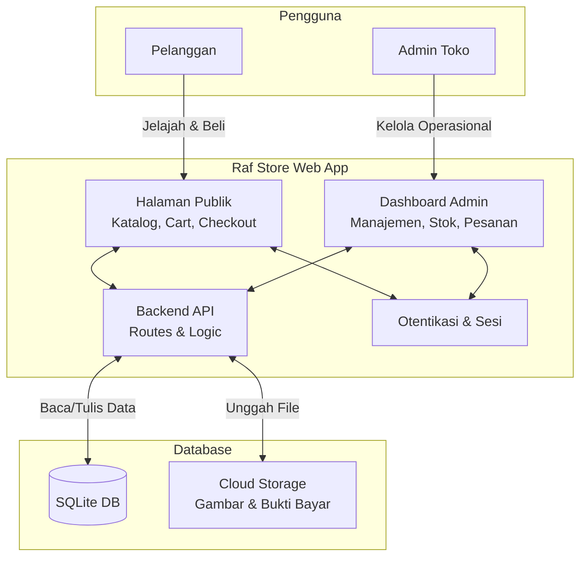
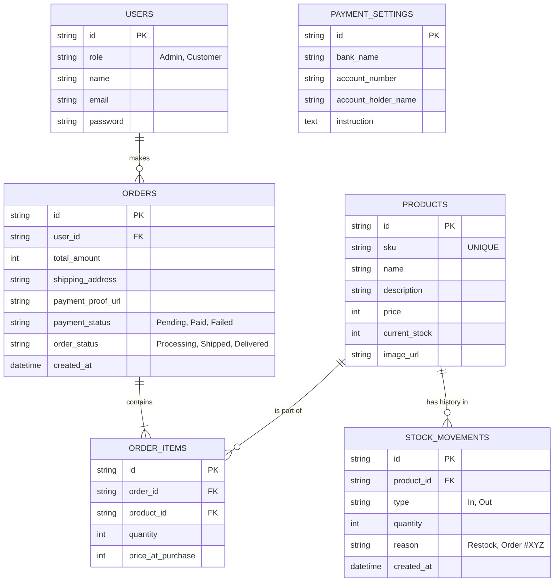

# PRD — Project Requirements Document

## 1. Overview
Raf Store saat ini melayani penjualan melalui berbagai saluran seperti marketplace, WhatsApp, dan offline luar jaringan. Hal ini membuat pengelolaan stok dan pemesanan rentan tidak sinkron. Aplikasi e-commerce internal ini dibuat untuk menyelesaikan masalah tersebut dengan menyediakan satu wadah (platform) terpusat. Tujuan utama platform ini adalah memudahkan pelanggan dalam melakukan pembelian secara mandiri, sekaligus memberikan dashboard khusus bagi admin atau pemilik toko untuk mengelola produk ber-SKU unik, merekam riwayat stok secara detail, dan memverifikasi pembayaran manual secara tersistem.

## 2. Requirements
*   **Platform Web Terpadu:** Sistem berbasis web yang bisa diakses dari browser HP maupun laptop/PC, melayani sisi pelanggan (etalase) dan sisi penjual (admin).
*   **Identifikasi Produk Spesifik:** Setiap barang wajib memiliki SKU (Stock Keeping Unit) yang unik untuk meminimalisasi kesalahan manajemen gudang.
*   **Manajemen Stok Mandiri:** Stok harus dapat dikelola secara komprehensif, mencakup penambahan stok masuk, pengurangan akibat pemesanan, dan pencatatan riwayat (log) perubahan stok.
*   **Transaksi Manual:** Mengakomodasi metode pembayaran transfer bank manual (non-gateway) di mana pembeli harus mengunggah bukti transfer, dan admin dapat memperbarui instruksi/rekening tujuan langsung dari dashboard.
*   **Manajemen Pelanggan Terpusat:** Pengguna anonim bisa melihat katalog, namun wajib mendaftar/login untuk melakukan checkout dan memantau riwayat transaksinya.

## 3. Core Features
Berdasarkan urutan pengembangan yang telah disepakati pada *roadmap*, berikut adalah fitur-fitur utamanya:

### Fase 1: Eksplorasi & Keranjang
*   **Jelajah Produk** [high] — Menampilkan katalog produk yang bisa dilihat dan dicari oleh calon pembeli.
    *   *Daftar Produk:* Melihat seluruh barang dengan informasi dasar (gambar, nama, harga).
    *   *Pencarian Produk:* Fitur kotak pencarian dengan kata kunci spesifik.
    *   *Detail Produk:* Menampilkan halaman khusus berisi deskripsi lengkap, sisa stok, dan harga satuan barang yang diklik.
*   **Keranjang Belanja** [high] — Tempat menyimpan sementara produk yang dipilih sebelum melangkah ke pembayaran.
    *   *Tambah ke Keranjang:* Tombol aksi memasukkan barang dari halaman detail/katalog.
    *   *Atur Isi Keranjang:* Fitur memperbarui kuantitas (tambah/kurang) produk serta menghapus produk dari keranjang.
    *   *Ringkasan Keranjang:* Kalkulasi sub-total belanja sebelum melanjutkan proses pesanan.

### Fase 2: Transaksi & Pengguna
*   **Checkout & Pembayaran Manual** [high] — Alur penyelesaian pesanan berbasis transfer manual.
    *   *Formulir Pengiriman:* Pengisian biodata penerima, alamat lengkap, dan kontak.
    *   *Panduan Transfer:* Halaman yang menampilkan total bayar, nomor rekening tujuan, serta cara transfer.
    *   *Konfirmasi Pembayaran:* Fitur unggah (upload) foto slip/bukti transfer oleh pelanggan.
    *   *Ringkasan Pesanan:* Rangkuman transaksi dan pelacakan status rilis/kirim.
*   **Akun Pelanggan** [high] — Portal personalisasi bagi pelanggan tetap Raf Store.
    *   *Daftar Akun:* Pembuatan akun baru bagi calon pembeli.
    *   *Login & Logout:* Sistem otentikasi masuk dan keluar yang aman.
    *   *Profil & Riwayat Pesanan:* Menu melihat data akun dan seluruh rekam jejak pesanan beserta status terkininya.

### Fase 3: Admin & Manajemen Toko
*   **Manajemen Produk & Stok** [high] — Pengaturan katalog dan gudang untuk pihak toko.
    *   *Tambah Produk Baru:* Form penambahan barang baru dengan validasi SKU unik, nama, foto, harga, dan stok mula-mula.
    *   *Edit & Hapus Produk:* Modifikasi atribut katalog atau penghapusan barang yang tidak dijual lagi.
    *   *Tambah Stok Masuk:* Penyesuaian bertambahnya fisik barang di gudang oleh admin.
    *   *Riwayat Perubahan Stok:* Tabel riwayat log (*stock ledger*) yang menampilkan kapan stok bertambah/berkurang, seberapa banyak, dan untuk apa.
    *   *Stok Terkini:* Dashboard *real-time* sisa ketersediaan barang untuk mencegah *overselling*.
*   **Pengaturan Pembayaran** [medium] — Administrasi metode penyelesaian pembayaran.
    *   *Atur Rekening Tujuan:* Form untuk mengganti, menghapus, atau menambah rekening bank resmi toko.
    *   *Atur Instruksi Pembayaran:* Teks dinamis yang bisa diatur admin untuk dimunculkan pada halaman "Panduan Transfer" saat pelanggan checkout.

## 4. User Flow
**Skenario Pelanggan (Belanja):**
1. Pelanggan membuka situs dan mencari produk (Pencarian/Etalase).
2. Pelanggan menekan "Tambah ke Keranjang" pada produk yang diinginkan.
3. Pelanggan menyelesaikan pesanan dengan menekan "Checkout".
4. Sistem meminta pelanggan Login atau Mendaftar jika belum memiliki akun.
5. Pelanggan mengisi formulir alamat pengiriman pesanan.
6. Halaman memunculkan Ringkasan Pesanan, Nomor Rekening Toko, dan Total Bayar.
7. Pelanggan melakukan transfer via bank/ATM kemudian mengunggah bukti bayar di aplikasi.
8. Pelanggan memantau status pesanan (Berhasil, Proses, Dikirim) di halaman Akun.

**Skenario Admin (Pengelolaan Toko):**
1. Admin Login menuju dashboard khusus.
2. *Manajemen Produk:* Admin menambahkan barang baru beserta SKU dan stok awal, atau menambah stok masuk produk lama.
3. *Operasional Pemesanan:* Admin melihat pesanan baru, memverifikasi kesesuaian nominal dengan unggahan bukti bayar pelanggan.
4. Admin memproses pengiriman dan stok akan berkurang secara otomatis atau tercatat dalam riwayat setelah pesanan divalidasi.
5. Admin dapat mengatur dan mengubah deskripsi instruksi pembayaran maupun rekening kapan saja diperlukan dari menu Pengaturan.

## 5. Architecture
Aplikasi akan dibangun menggunakan arsitektur *Client-Server* modern. Seluruh antarmuka pembeli (Storefront) dan penjual (Admin Dashboard) disatukan dalam satu repository aplikasi web. Pengelolaan data (*Database*) bertindak sebagai pusat kebenaran tunggal (*Single Source of Truth*) baik untuk otentikasi login, informasi produk, transaksi, maupun riwayat stok.

## 6. Database Schema
Untuk menjalankan inti fitur aplikasi yang diinginkan, kita memerlukan beberapa tabel dalam basis data sebagai berikut:

*   **Users**: Menyimpan kredensial dan profil pelanggan maupun admin.
*   **Products**: Data inti barang jualan atau katalog toko.
*   **Stock_Movements**: Log catatan masuk dan keluarnya jumlah produk.
*   **Orders**: Data rekap keseluruhan sebuah pesanan oleh pelanggan.
*   **Order_Items**: Rincian setiap produk dalam satu *Order* (nomor pesanan belanja).
*   **Payment_Settings**: Menyimpan konfigurasi instruksi dan rekening bank toko yang bisa diatur dinamis oleh admin.

## 7. Tech Stack
Karena belum ditentukan secara eksplisit di awal, pilihan teknologi ini difokuskan pada pengembangan aplikasi berbasis web yang cepat, mudah dipelihara, hemat biaya (*budget friendly* untuk UMKM), serta berjalan responsif dan interaktif.

*   **Frontend Framework:** Next.js (App Router) — Menggabungkan UI yang cepat untuk pelanggan dan keamanan kuat.
*   **UI/Styling:** Tailwind CSS & shadcn/ui — Menyediakan komponen *interface* yang cantik, modern, minimalis dan bersih serta mudah dipahami oleh pembeli secara instan.
*   **Backend & API:** Next.js API Routes / Server Actions — Pengaturan alur data langsung berada di satu tempat bersama *frontend*.
*   **Database:** SQLite — Sistem *database* yang efisien, ringan, solid dan cocok untuk toko seperti Raf Store fase menengah.
*   **ORM (Penghubung Database):** Drizzle ORM — Ringan dan menjamin keamanan tipe (*Type-Safety*) pada ekosistem data.
*   **Authentication:** Better Auth — Standar kemanan modern untuk sistem pelanggan Mendaftar & Login.
*   **Deployment & Storage (Rekomendasi):** Vercel (untuk aplikasi) & solusi penyimpanan pihak ketiga ringan seperti Supabase Storage atau Uploadcare untuk menampung gambar produk dan foto bukti bayar yang dikirim pelanggan.